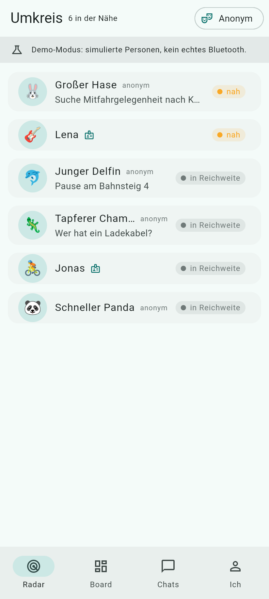
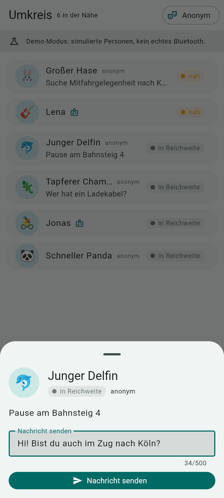
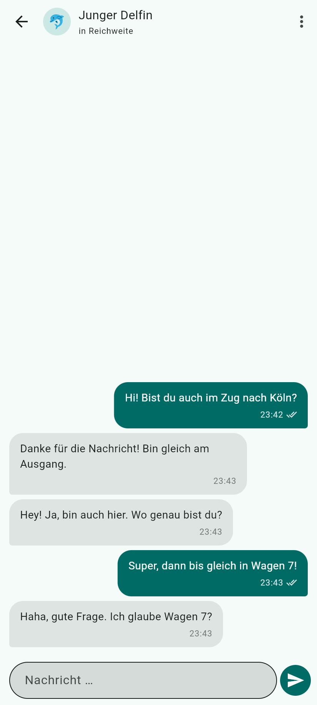
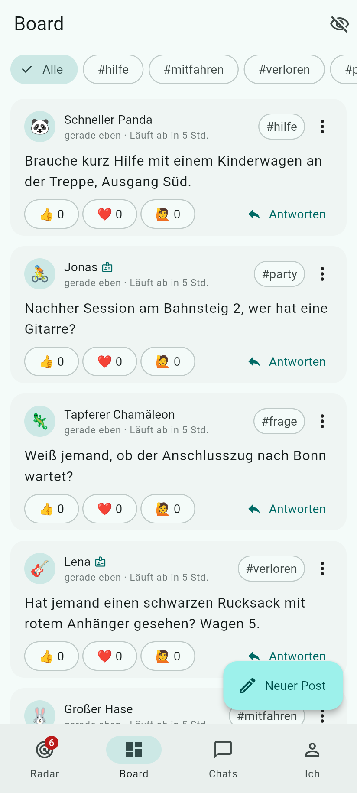

# Umkreis

> Menschen im Umkreis von 10 bis 100 Metern **offline** per Bluetooth finden,
> anonym oder mit Profil anschreiben und an ein lokales Brett posten.
> Kein Server, kein Account, keine Telefonnummer.

Flutter-App für **iPhone und Android** (Web nur als Demo). Die Konzept- und
Protokolldokumente liegen in [`konzept/`](konzept/README.md).

## Screenshots (Demo-Modus im Browser)

| Radar | Anfrage | Chat | Board |
| --- | --- | --- | --- |
|  |  |  |  |

Weitere: [Onboarding](docs/screenshots/onboarding.png) · [Alias](docs/screenshots/alias.png) · [Ich](docs/screenshots/ich.png)

## Was die App kann (MVP)

| Bereich | Funktion |
| --- | --- |
| **Radar** | Zeigt alle Geräte mit der App in Funkreichweite mit Alias/Name, Emoji, Status und Nähe-Stufe (sehr nah · nah · in Reichweite). |
| **Modi** | *Unsichtbar* (sehen, aber nicht gesehen werden), *Anonym* (zufälliger Alias, wechselt täglich, Standard), *Profil* (Name, Emoji, Bio, Interessen). |
| **Chat** | Erste Nachricht ist eine Kontaktanfrage (annehmen / ignorieren / blockieren). Danach Ende-zu-Ende-verschlüsselter 1:1-Chat mit Zustellbestätigung. Nachrichten warten, bis der andere wieder in Reichweite ist. Profil kann im Chat „aufgedeckt“ werden. |
| **Board** | Anonyme oder Profil-Posts mit Tag (#hilfe, #mitfahren, #verloren, #party, #frage, #notfall) und Ablaufzeit, Antworten, Reaktionen. Synchronisiert sich automatisch mit Geräten in Reichweite. |
| **Schutz** | Blockieren (Geräte-Fingerabdruck bzw. Post-Schlüssel), Melden (lokal, exportierbar), Wortfilter, Rate-Limits, signierte Posts, rotierende Funk-Kennungen gegen Tracking. |
| **Sprachen** | Deutsch und Englisch, in der App umschaltbar. |

## Technik in einem Absatz

Jedes Gerät ist gleichzeitig BLE-**Peripheral** (sendet Advertising mit einer
alle 15 Minuten wechselnden Kennung, bietet einen GATT-Dienst an) und BLE-
**Central** (scannt, verbindet, liest Presence/Profil/Board, schreibt Frames).
Chats werden über einen Noise-XX-artigen Handshake (X25519, Ed25519-Signaturen)
aufgebaut und mit XChaCha20-Poly1305 verschlüsselt. Alles Weitere in
[`konzept/protokoll.md`](konzept/protokoll.md).

## Projektstruktur

```text
lib/
├── main.dart                 Einstieg
├── app/                      App-Shell, Theme, Lokalisierung, Bootstrap, Berechtigungen
├── core/
│   ├── protocol/             Konstanten, Frame-Codec, Chunking, CBOR, Datenmodelle
│   ├── crypto/               Identität, EID-Ableitung, Alias, Handshake, Session
│   ├── ble/                  Transport-Interface, BLE-Implementierung, Fake-Welt, RSSI
│   ├── storage/              sembast-Datenbank und Repositories
│   ├── moderation/           Blockliste, Rate-Limiter, Wortfilter
│   └── services/             Identity, Radar, Chat, Board, Engine (verbindet alles)
├── demo/                     Simulierte Personen für den Demo-Modus
└── features/                 Screens: Onboarding, Radar, Board, Chats, Ich
test/
├── core/                     Unit- und End-to-End-Tests (zwei Engines über die Fake-Welt)
└── widget/                   Widget-Tests der Screens
konzept/                      Konzept, Technik-Entscheidungen, Protokoll-Spezifikation
```

Die Schichten kommunizieren nur nach unten (`features → services → core`).
`core/ble` kennt keine Chat-Logik, es transportiert Bytes; deshalb lässt sich
der echte Bluetooth-Transport 1:1 durch die Fake-Welt ersetzen, mit der Tests
und der Demo-Modus laufen.

## Entwicklung

Voraussetzungen: [Flutter](https://docs.flutter.dev/get-started/install) 3.47
oder neuer, für Android das Android SDK (minSdk 24), für iOS Xcode.

```bash
flutter pub get
flutter analyze
flutter test
```

### Auf echten Geräten (Bluetooth)

Bluetooth Low Energy funktioniert **nicht** in Emulatoren und Simulatoren.
Für den Nähe-Test braucht es zwei physische Geräte, idealerweise ein iPhone und
ein Android-Gerät.

```bash
flutter run            # Gerät angeschlossen; iOS braucht ein Signing-Team in Xcode
```

- **Android** fragt beim ersten Start die Bluetooth-Berechtigungen ab (ab
  Android 12: Scan, Advertise, Connect; darunter Standort, es wird aber kein
  Standort erfasst).
- **iOS** fragt über CoreBluetooth. Ein iPhone ist nur sichtbar, solange die
  App im Vordergrund ist (Plattform-Grenze, siehe `konzept/technik.md`).

Testfälle für den ersten Geräte-Test stehen in
[`konzept/protokoll.md`](konzept/protokoll.md#9-testfälle-für-phase-0-spike).

### Demo-Modus ohne Bluetooth

Simulierte Personen laufen über exakt denselben Code wie echte Geräte, nur der
Funk ist simuliert. Sie nehmen Anfragen an, antworten und posten.

```bash
flutter run --dart-define=UMKREIS_DEMO=true      # auf jedem Gerät/Emulator
flutter run -d chrome                            # Web ist immer Demo-Modus
flutter build web --release --no-web-resources-cdn
```

## Status und nächste Schritte

Umgesetzt ist **Phase 1 (MVP)** aus der Roadmap in `konzept/technik.md`. Die
Logik ist durch Unit-, End-to-End- (zwei Engines über die Fake-Welt) und
Widget-Tests abgedeckt; der echte Bluetooth-Transport ist gegen die API des
Pakets `bluetooth_low_energy` geschrieben, aber noch **nicht auf physischen
Geräten** getestet. Genau das ist der nächste Schritt:

1. Spike auf iPhone + Android: Sichtbarkeit, Nähe-Stufen kalibrieren, Handshake, Chat.
2. Akku- und Verbindungs-Tuning (Scan-Duty-Cycle, MTU, Idle-Timeouts).
3. Android Foreground Service für Hintergrund-Betrieb; iOS-Hintergrund dokumentieren.
4. Phase 2: Bilder im Chat (L2CAP), Store-Listing, Datenschutzerklärung, TestFlight / Play Internal Testing.
5. Phase 3: Board-Mesh (Weiterleitung über 3–5 Hops), Gruppen, Notfall-Modus.
